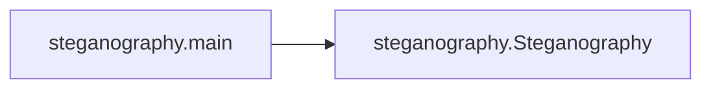

# Key Objects

[_Documentation generated by Documatic_](https://www.documatic.com)

<!---Documatic-section-steganography.main-start--->
## steganography.main

<!---Documatic-section-main-start--->


### Object Calls

* steganography.Steganography

<!---Documatic-block-steganography.main-start--->
<details>
	<summary><code>steganography.main</code> code snippet</summary>

```python
def main():
    parser = argparse.ArgumentParser(description='Steganography')
    subparser = parser.add_subparsers(dest='command')
    merge = subparser.add_parser('merge')
    merge.add_argument('--image1', required=True, help='Image1 path')
    merge.add_argument('--image2', required=True, help='Image2 path')
    merge.add_argument('--output', required=True, help='Output path')
    unmerge = subparser.add_parser('unmerge')
    unmerge.add_argument('--image', required=True, help='Image path')
    unmerge.add_argument('--output', required=True, help='Output path')
    args = parser.parse_args()
    if args.command == 'merge':
        image1 = Image.open(args.image1)
        image2 = Image.open(args.image2)
        Steganography().merge(image1, image2).save(args.output)
    elif args.command == 'unmerge':
        image = Image.open(args.image)
        Steganography().unmerge(image).save(args.output)
```
</details>
<!---Documatic-block-steganography.main-end--->
<!---Documatic-section-main-end--->

# #
<!---Documatic-section-steganography.main-end--->

[_Documentation generated by Documatic_](https://www.documatic.com)